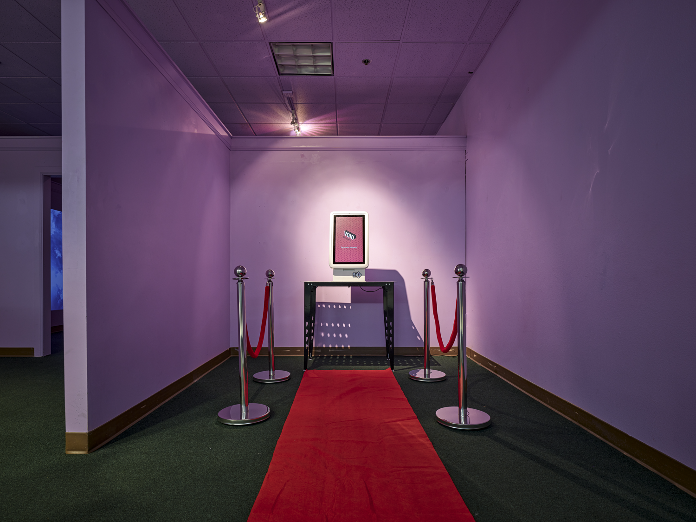

# VOID MART

## An art installation, peppered with some very creepy performance art vibes.

I was lucky enough to have an artist residency at [ILY2](https://ily2online.com/) in Portland, OR. This installation lasted for the whole month of October 2024 at the Lloyd Center Mall in Portland, OR. The setting was in a semi-abandoned mall space, previously occupied by "Super Shots" in another business life, with the signage very much intact and visible.

The core of the experience was an industrial self-serve kiosk, with a "shopping" experience being my take on the Faust and Mephistopheles trope of "make a deal/pact with the devil"... but represented as a soulless automated Chuck E. Cheese prize counter version...

  
_"Please take a ticket and have a seat"_

  
_"You may now proceed to your next-generation shopping experience"_

  
When shopping, there were ~15 different "items" to choose from, powers/abilities ranging from "Always Find a Parking Spot" to "Avoid Small Talk at a Party." One item per customer, for the low, low price of "One Fraction of Your Intangible Essence." The terms and conditions are explicit, and you get a printed receipt of your transaction when you are finished.

  
_"Accepting the Terms & Conditions is not optional"_

  
Once finished with your purchase, customers were _immediately_ ushered into the "Customer Feedback" room to fill out a seemingly generic [NPS-like](https://en.wikipedia.org/wiki/Net_promoter_score) satisfaction card. The most important ominous question being "How do you feel right now, physically or mentally?"  

Once the feedback was complete, the last step was to repeat some inconsequential Latin phrases, and your attendant would cut their hand open to bleed and finalize the Terms and Conditions.

### Media & reception

- A series of [Instagram posts](https://www.instagram.com/ily2.too/) to ILY2's main page was most of the promotion done, outside of word of mouth.
- I produced a [promotional video](https://www.youtube.com/watch?v=b-KTJYjXASc) with the fictional CEO of VOIDCORP before the first showing date, using AI-generated actors to lean on the uncanny valley aspect of the whole installation.
- Naturally, because of the physical location in a public mall, there were quite a few [TikToks](https://www.tiktok.com/t/ZTFtQ9pYk/) posted by people speculating as to what this closed storefront was, or someone who had attended and encouraged others to visit.

At the end, over the 9 hours of opening, 122 people attended the showing, which is someone every ~4.4 minutes on average.

The most "purchased" item was `Free Pass to Avoid Traffic, More Often Than Not`, and the second most popular was `Never Forget a Name (But Occasionally Mix Them Up)`.

### Retrospect

I was pleasantly surprised at the turnout for this weird, off-beat art installation experience. What I didn't expect was the sheer level of psychological horror that affected a dozen people or so, most of them bailing mid-experience with claims of having too much anxiety or being too scared about the consequences.

### Next steps

VOID MART lives on and will be shuffled between different bars in the Portland area at unexpected times, for a random duration. The ultimate goal is to cultivate an aura of local myth that someone "might have seen that kiosk" at some time, or express knowing about it but can't recall when or where they saw it.